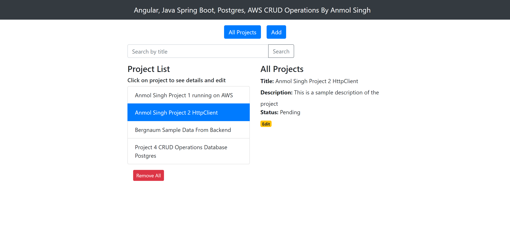

# Java Spring Boot + Angular 15 + PostgreSQL + AWS CRUD Operations By Anmol Singh

## Deployed live at https://anmolsingh-spring-angular.web.app/

#### Spring Boot API Documentation using Swagger at https://anmolsingh-api.up.railway.app/swagger-ui/

Full-stack Angular 15 + Spring Boot + PostgreSQL + AWS CRUD Operations in that:

- Each Project has id, title, description, published status.
- We can create, retrieve, update, delete Projects.
- We can also find Projects by title.




## Run Spring Boot application

```
mvn spring-boot:run
```

The Spring Boot Server will export API at port `8081`.

## Run Angular Client

```
npm install
ng serve --port 8081
```
